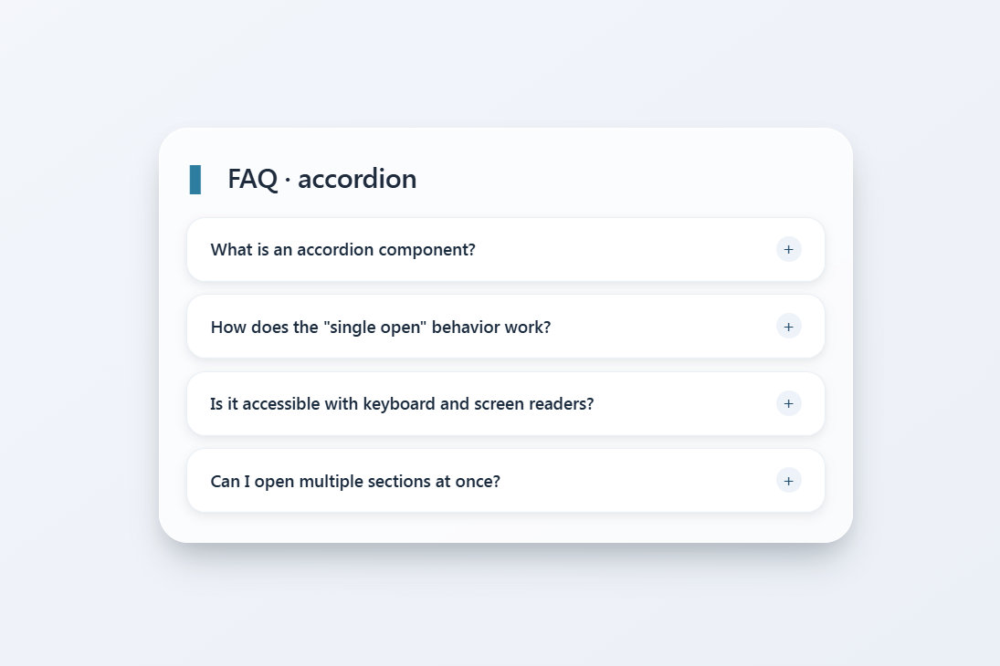

# Accordion Pure jQuery.

[](https://github.com/Darshittank/Accordion-pure-jQuery/stargazers)
[](https://github.com/Darshittank/Accordion-pure-jQuery/network)
[](https://github.com/Darshittank/Accordion-pure-jQuery/issues)
[](https://opensource.org/licenses/MIT)
[](https://darshittank.github.io/Accordion-pure-jQuery)

## 🎯 Live Demo
👉 **[View Accordion Pure jQuery Now!](https://darshittank.github.io/Accordion-pure-jQuery/)** 👈

## 🗺️ Roadmap.sh Solution
👉 **[View My Accordion Pure jQuery Solution](https://roadmap.sh/projects/accordion/solutions?u=6a54aaccace5f057736e8164)** 👈


## 📌 Project Page
👉 **[Accordion Pure jQuery Project](https://roadmap.sh/projects/accordion)** 👈

## 📖 **About Accordion Pure jQuery**

A modern, responsive accordion component built with HTML, CSS, and pure jQuery featuring smooth expand/collapse transitions, single-open behavior, and clean, reusable code.

### 🎯 **Key Features**

- 🧩 Smooth jQuery-powered expand/collapse animations
- 🧩 Single-open behavior (only one panel at a time)
- 🧩 Responsive design for all screen sizes
- 🧩 Lightweight and fast
- 🧩 Accessible with ARIA attributes
- 🧩 Easy to customize
- 🧩 Clean HTML, CSS, and JavaScript
- 🧩 Beginner-friendly code structure

## 📸 Preview



📦 Use Cases
- Websites & blogs
- Admin dashboards
- Creative UI designs

🚀 Getting Started
- Paste into your project
- Customize styles as needed

🎯 Goal
- To provide developers and designers with scalable, modern, and efficient Tooltip solutions that save time and improve user experience.

🤝 Contributing
- Contributions are welcome! Feel free to submit new patterns, improvements, or bug fixes.

  

## 🙌 Author

**Darshit**

⭐ Show Your Support

If you like this project, please give it a ⭐ on GitHub! It helps others discover it too.

Made with ❤️ and lots of GSAP-Tabs!

## 🚀 **Installation**

### Local Development

```bash
# Accordion

## Live Demo
https://darshittank.github.io/Accordion-pure-jQuery/

## Repository
https://darshittank.github.io/Accordion-pure-jQuery/

## Roadmap.sh Project
https://darshittank.github.io/Accordion-pure-jQuery/
